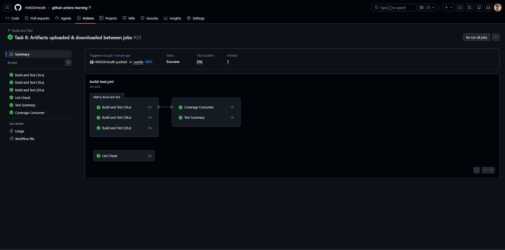
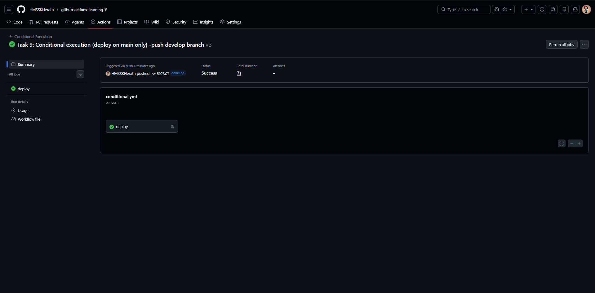
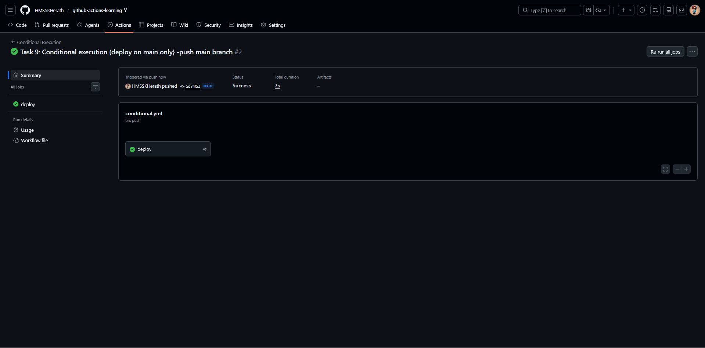
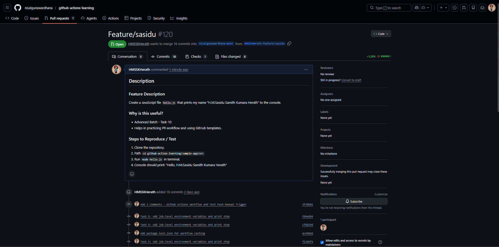
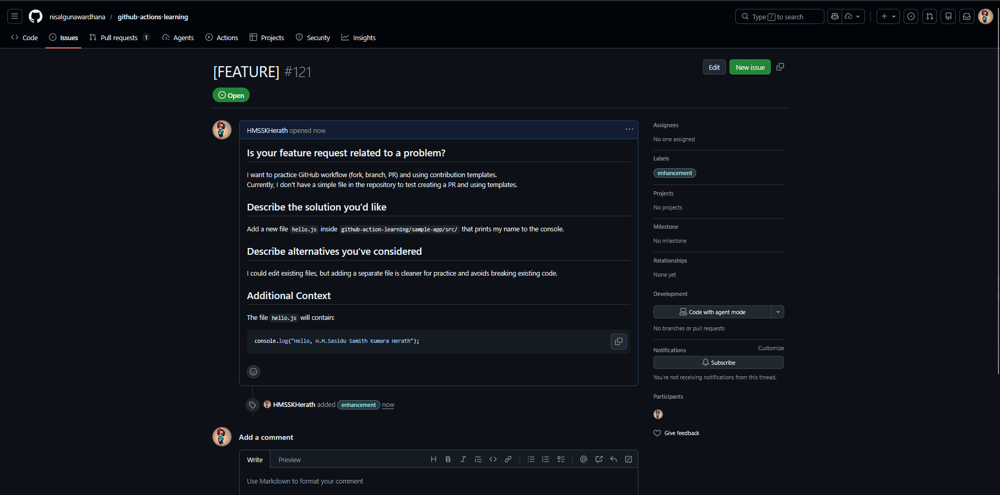

# Advanced Badge Submission - sasidu

**Date:** February 2026
**Status:** Submitted for Review

## Tasks Completed

- [x] Task 8: Artifacts uploaded & downloaded between jobs
- [x] Task 9: Conditional execution (deploy on main only)
- [x] Task 10: PR created with template & issue using template

## Evidence

### Task 8: Artifacts uploaded & downloaded between jobs
- Screenshot        : 
- Workflow run link : https://github.com/HMSSKHerath/github-actions-learning/actions/runs/21776909794

### Task 9: Conditional execution (deploy on main only)
- Screenshot        : 
                      
                      
                      
- Workflow run link : https://github.com/HMSSKHerath/github-actions-learning/actions/runs/21777264959
                      https://github.com/HMSSKHerath/github-actions-learning/actions/runs/21777199390

### Task 10: PR created with template & issue using template
- Screenshot        : 
                      
- Evidence          : https://github.com/nisalgunawardhana/github-actions-learning/pull/120
                      https://github.com/nisalgunawardhana/github-actions-learning/issues/121

Submitted & ready for review! ✅