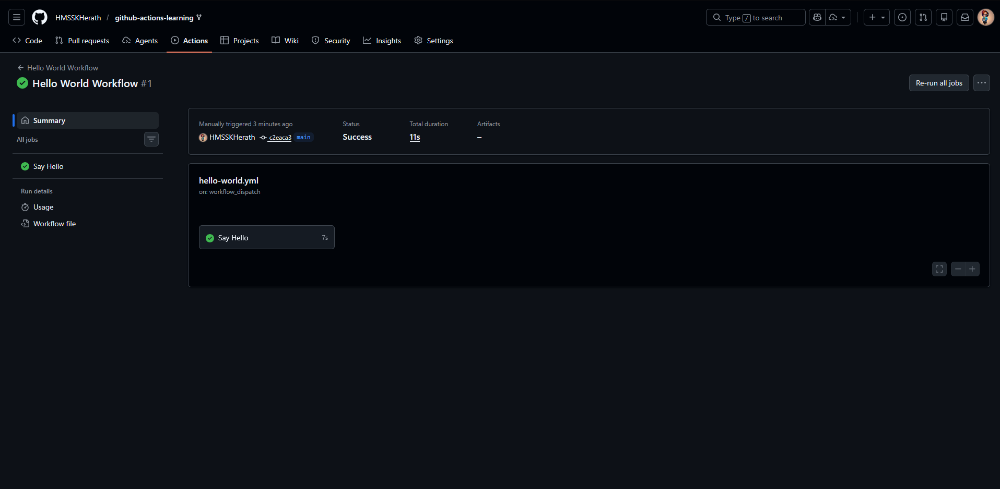
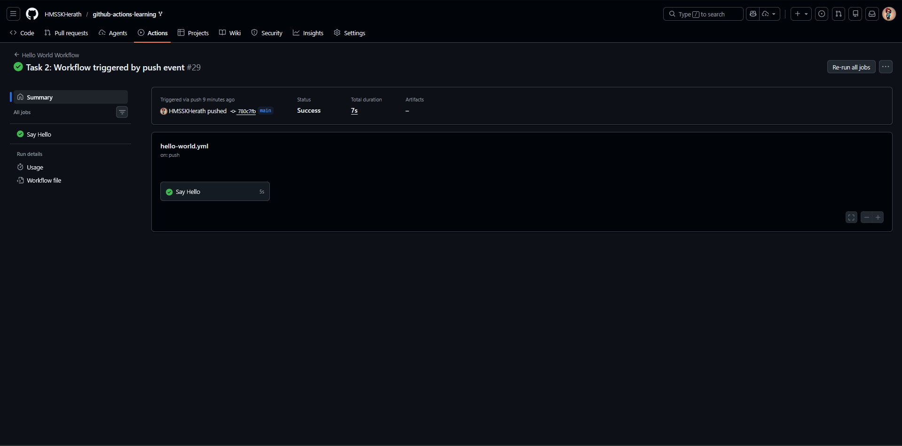
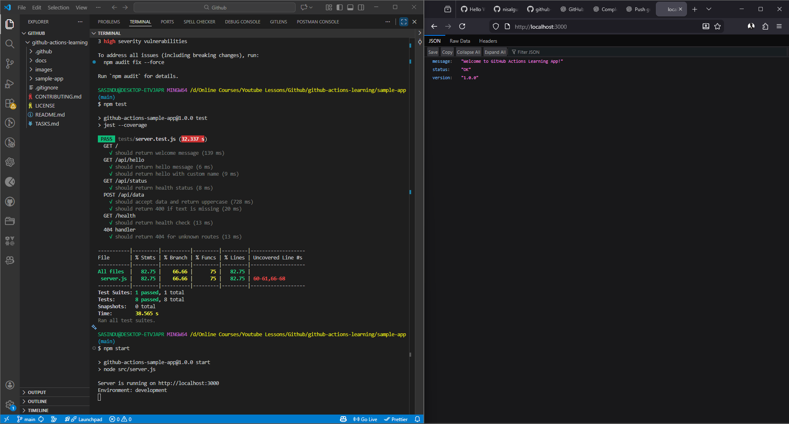

# Beginner Badge Submission - sasidu

**Date:** February 2026
**Status:** Submitted for Review

## Tasks Completed

- [x] Task 1: Run Your First Workflow
- [x] Task 2: Understand Workflow Triggers
- [x] Task 3: Build and Test Locally

## Evidence

### Task 1: Hello World Workflow
- Screenshot        : 
- Workflow run link : https://github.com/HMSSKHerath/github-actions-learning/actions/runs/21708141976

### Task 2: Push Trigger
- Screenshot        : 
- Workflow run link : https://github.com/HMSSKHerath/github-actions-learning/actions/runs/21708829578

### Task 3: Local Tests
- Screenshot        : 
- Evidence          : Local `npm test` Passed Successfully.