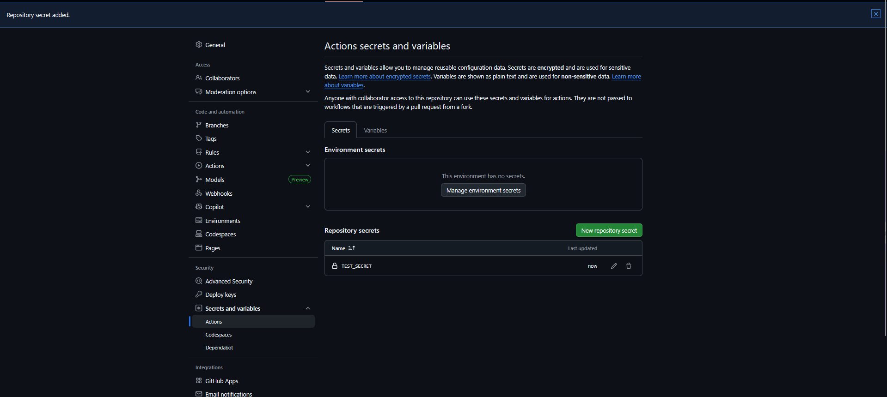

# Intermediate Badge Submission - sasidu

**Date:** February 2026
**Status:** Submitted for Review

## Tasks Completed

- [x] Task 4: Custom workflow running on develop branch 
- [x] Task 5: Environment variables displaying in logs
- [x] Task 6: GitHub secrets access (masked in logs)
- [x] Task 7: Matrix testing across 3 Node versions in parallel

## Evidence

### Task 4: Custom workflow running on develop branch 
- Screenshot        : 
- Workflow run link : https://github.com/HMSSKHerath/github-actions-learning/actions/runs/21727028782

### Task 5: Environment variables displaying in logs
- Screenshot        : 
                      
- Workflow run link : https://github.com/HMSSKHerath/github-actions-learning/actions/runs/21743332223

### Task 6: GitHub secrets access (masked in logs)
- Screenshot        : 
                      
                      
- Evidence          : https://github.com/HMSSKHerath/github-actions-learning/actions/runs/21744877725

### Task 7: Matrix testing across 3 Node versions in parallel
- Screenshot        : 
- Evidence          : https://github.com/HMSSKHerath/github-actions-learning/actions/runs/21745251895

Submitted & ready for review! ✅
